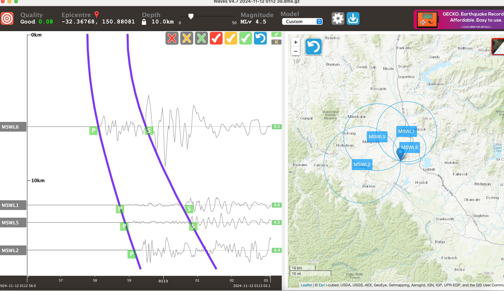

# Earthquake Location Project

This repository contains the location and phase arrival picks for an earthquake event. The data has been processed and can be further analyzed to relocate the event using the **Waves** software. The event details and associated phase picks are included in this repository.

## Event Report

The earthquake event can be reviewed in detail through the official [event report](https://earthquakes.ga.gov.au/event/ga2024widwze).

## Code: `download_data.ipynb`

The data download and processing are performed in the Jupyter notebook `download_data.ipynb`. This notebook uses **Python** and the **ObsPy** library to download seismic data, extract waveforms, and process them for further analysis.

### Key Features of the Code:
- Downloads seismic data from the IRIS FDSN web service.
- Retrieves waveforms for specified stations.
- Saves the waveforms in **MiniSEED** format.
- Allows for further processing and picking of **P** and **S** phases.

You can open and run the notebook in a Jupyter environment to explore and replicate the data downloading and processing workflow.

## Software for Relocation: Waves

Users can download the free **Waves** software (from the Seismology Research Centre) to relocate the event. Waves is a tool used to analyze seismic data and perform earthquake relocations using phase picks.

You can download Waves from [here](https://www.src.com.au/downloads/waves/).

## Phase Arrival Picks

The **P** and **S** phase arrival picks are saved in the `.dmz` file. These picks can be used in relocation software like Waves to refine the earthquake location.

Alternatively, you can open the MiniSEED files provided in the repository and manually pick the **P** and **S** phase arrivals using any seismic analysis tool such as ObsPy or others.

## Local Image

Below is a plot of the event location and seismic data:



Please ensure the `images` folder contains the image file `event_location.png`. You can modify this section with your own image and location.

## Getting Started

1. Clone this repository:
    ```bash
    git clone https://github.com/yourusername/melbourne-earthquake-science.git
    cd melbourne-earthquake-science
    ```

2. Set up a Python environment with the necessary dependencies:
    ```bash
    conda create -n earthquake_analysis python=3.8
    conda activate earthquake_analysis
    pip install obspy
    ```

3. Open the `download_data.ipynb` notebook and run the cells to download the seismic data.

4. For phase picking and event relocation, use **Waves** or other seismic tools to process the data.


